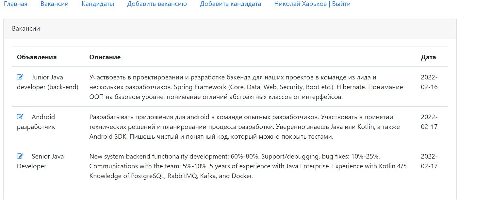
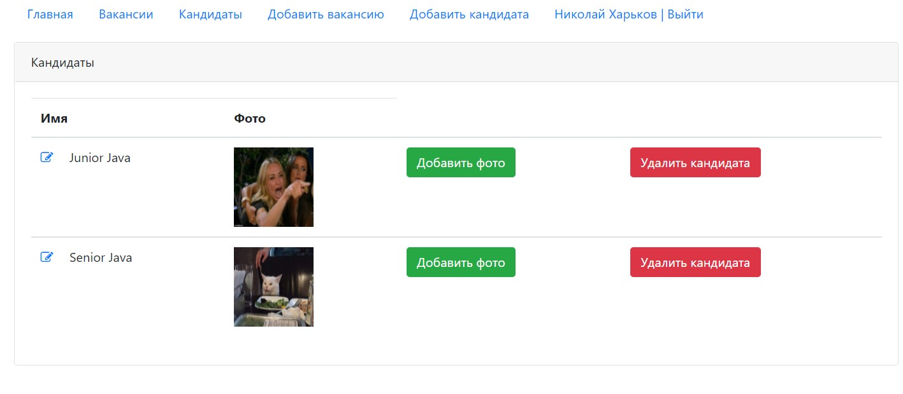
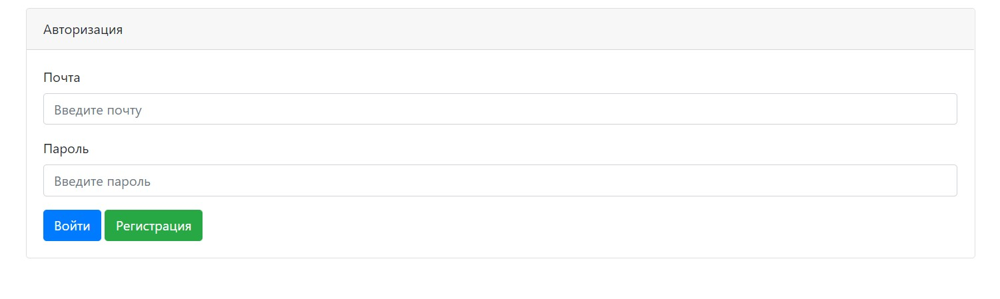
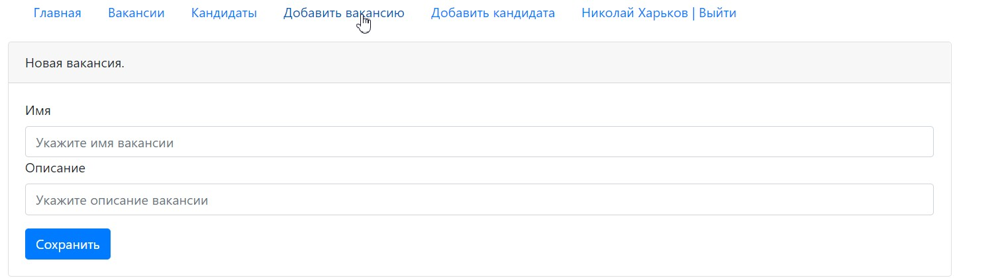
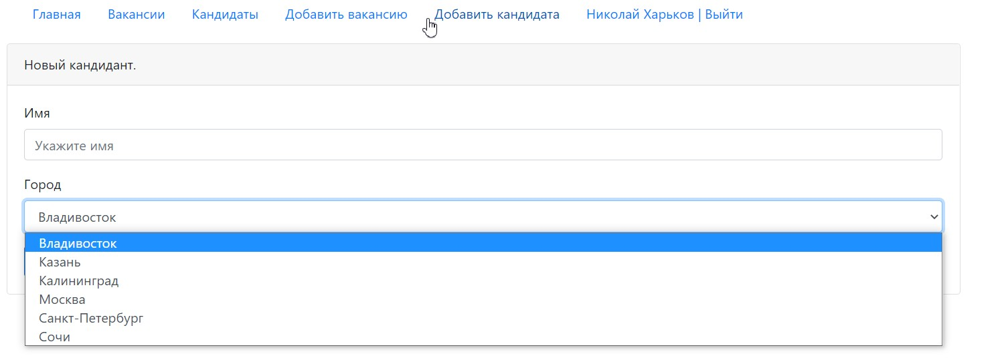

# Job4j. Проект "Работа мечты".

Учебный проект "Биржа труда". 
Доступные возможности:
- Регистрация
- Загрузка файлов
- Создание, редактирование вакансий, кандидатов
При создании использовались следующие технологии:
- Servlets
- JSP
- Postgres
- Liquibase

